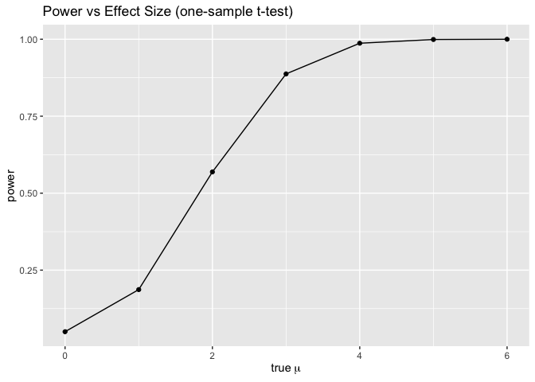
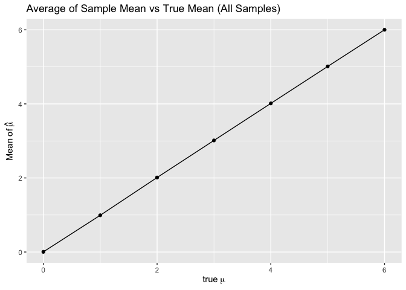
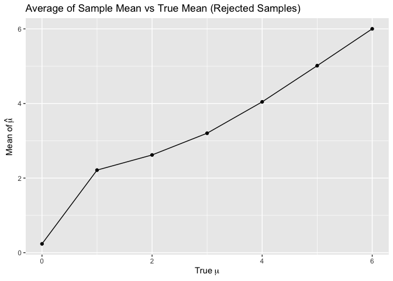
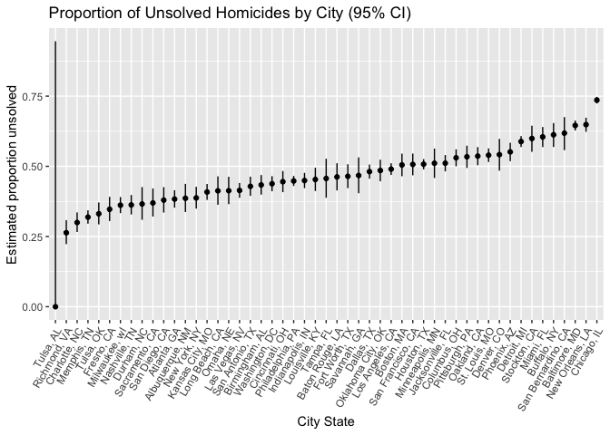

p8105_hw5_hy2958
================
2025-11-14

``` r
library(tidyverse)
```

    ## ── Attaching core tidyverse packages ──────────────────────── tidyverse 2.0.0 ──
    ## ✔ dplyr     1.1.4     ✔ readr     2.1.5
    ## ✔ forcats   1.0.0     ✔ stringr   1.5.1
    ## ✔ ggplot2   3.5.2     ✔ tibble    3.3.0
    ## ✔ lubridate 1.9.4     ✔ tidyr     1.3.1
    ## ✔ purrr     1.1.0     
    ## ── Conflicts ────────────────────────────────────────── tidyverse_conflicts() ──
    ## ✖ dplyr::filter() masks stats::filter()
    ## ✖ dplyr::lag()    masks stats::lag()
    ## ℹ Use the conflicted package (<http://conflicted.r-lib.org/>) to force all conflicts to become errors

``` r
set.seed(1)
```

``` r
#problem 1
has_duplicate_birthday <- function(n) {
  birthdays <- sample(1:365, size = n, replace = TRUE)
  any(duplicated(birthdays))
}

birthday_prob_loop <- function(n, n_sim = 10000) {
  result <- logical(n_sim)  ##create all 'false' list
  for (i in 1:n_sim) {
    result[i] <- has_duplicate_birthday(n)
  }
  mean(result)
}


birthday_df <- tibble(
  group_size = 2:50,
  prob_shared = map_dbl(2:50, birthday_prob_loop)
)

#plot
birthday_df %>%
  ggplot(aes(x = group_size, y = prob_shared)) +
  geom_line()+
  labs(
    title = "Birthday Duplication Simulation",
    x = "Group Size",
    y = "Probability of Shared Birthday"
  ) 
```

<!-- --> The
plot shows the estimated probability that at least two people in a group
share the same birthday changes with the group size.

When the group size is small, the probability is close to 0, as the
group size continues to increase, the probability grows quickly and
approaches 1.

``` r
#problem 2
simulate_one <- function(mu, n = 30, sigma = 5, alpha = 0.05) {
  x <- rnorm(n, mean = mu, sd = sigma)
  tibble(
    mu_hat = mean(x),
    p_value = t.test(x, mu = 0) |> broom::tidy() |> pull(p.value)
  )
}

simulate_many <- function(mu, nn=5000, n = 30, sigma = 5) {
  out <- vector("list", 5000) #create space
  for (i in 1:5000) {
    out[[i]] <- simulate_one(mu = mu, n = n, sigma = sigma)
  }
  bind_rows(out) |>
    mutate(mu_true = mu,
           reject = p_value < 0.05)
}

mu_grid <- 0:6
sim_all <- map_dfr(mu_grid, simulate_many, nn = 5000, n = 30, sigma = 5)

power_df <- sim_all %>% 
  group_by(mu_true)  %>% 
  summarise(power = mean(reject), .groups = "drop")

avg_overall <- sim_all  %>% 
  group_by(mu_true)  %>% 
  summarise(avg_mu_hat = mean(mu_hat), .groups = "drop")

avg_rejected <- sim_all  %>% 
  filter(reject)  %>% 
  group_by(mu_true)  %>% 
  summarise(avg_mu_hat_reject = mean(mu_hat), .groups = "drop")

#plots
#effect size and power
p_power <- ggplot(power_df, aes(x = mu_true, y = power)) +
  geom_line() + geom_point() +
  labs(title = "Power vs Effect Size (one-sample t-test)",
       x = expression(true~mu))

p_power
```

<!-- -->

``` r
#the average estimate of 𝜇̂ and the true value of 𝜇
p_avg_all <- ggplot(avg_overall, aes(x = mu_true, y = avg_mu_hat)) + 
  geom_line() + 
  geom_point() +
  labs(title = "Average of Sample Mean vs True Mean (All Samples)",
       x = expression(true~mu), y = expression(Mean~of~hat(mu)))

p_avg_all
```

<!-- -->

``` r
#the average estimate of 𝜇̂ only in samples for which the null was rejected 

p_avg_reject <- ggplot(avg_rejected, aes(x = mu_true, y = avg_mu_hat_reject)) +
  geom_line() +
  geom_point() +
  labs(
    title = "Average of Sample Mean vs True Mean (Rejected Samples)",
    x = expression(True~mu),
    y = expression(Mean~of~hat(mu))
  ) 

p_avg_reject
```

<!-- -->
plot1: The plot shows a positive association between effect size (true
μ) and power. As the true mean μ moves farther from 0 (the null value),
the probability of rejecting H₀ increases sharply. When μ ≈ 0, power is
low (near the nominal α = 0.05 level). As μ increases to around 2–3,
power rises quickly above 0.5, and for μ ≥ 4, power approaches 1.

plot2&3: The sample average of mu hat where the null is rejected is not
approximately equal to the true value of mu

This happens because of selection bias, when we condition on statistical
significance (p \< 0.05), we only keep the samples with unusually large
sample means (those that happened to deviate most from 0).

``` r
#problem 3.1
data = read_csv("./homicide-data.csv") %>% 
  mutate(city_state = str_c(city, ", ", state)) 
```

    ## Rows: 52179 Columns: 12
    ## ── Column specification ────────────────────────────────────────────────────────
    ## Delimiter: ","
    ## chr (9): uid, victim_last, victim_first, victim_race, victim_age, victim_sex...
    ## dbl (3): reported_date, lat, lon
    ## 
    ## ℹ Use `spec()` to retrieve the full column specification for this data.
    ## ℹ Specify the column types or set `show_col_types = FALSE` to quiet this message.

``` r
city_homicide <- data %>% 
group_by(city_state) %>%
  summarize(
    total = n(),
    unsolved = sum(disposition %in% c("Closed without arrest", "Open/No arrest"))
    ) 

city_homicide
```

    ## # A tibble: 51 × 3
    ##    city_state      total unsolved
    ##    <chr>           <int>    <int>
    ##  1 Albuquerque, NM   378      146
    ##  2 Atlanta, GA       973      373
    ##  3 Baltimore, MD    2827     1825
    ##  4 Baton Rouge, LA   424      196
    ##  5 Birmingham, AL    800      347
    ##  6 Boston, MA        614      310
    ##  7 Buffalo, NY       521      319
    ##  8 Charlotte, NC     687      206
    ##  9 Chicago, IL      5535     4073
    ## 10 Cincinnati, OH    694      309
    ## # ℹ 41 more rows

``` r
baltimore <- city_homicide %>%
  filter(city_state == "Baltimore, MD") 

baltimore_test <- prop.test(
  x = baltimore$unsolved,     
  n = baltimore$total         
)

baltimore_tidy <- broom::tidy(baltimore_test)%>%
  select(estimate, conf.low, conf.high)

baltimore_tidy
```

    ## # A tibble: 1 × 3
    ##   estimate conf.low conf.high
    ##      <dbl>    <dbl>     <dbl>
    ## 1    0.646    0.628     0.663

The raw data contains 52179 observations and 12 variables, included the
location of the killing, whether an arrest was made and, in most cases,
basic demographic information about each victim.

``` r
#problem 3.2
city_props <- city_homicide  %>%
  mutate(
    test = purrr::map2(unsolved, total, ~ prop.test(x = .x, n = .y)),
    tidy = purrr::map(test, broom::tidy) 
    ) %>%
  unnest(tidy) %>%      # unfold list-column
  select(city_state, total, unsolved, estimate, conf.low, conf.high) %>%
  arrange(desc(estimate)) #reorder
```

    ## Warning: There was 1 warning in `mutate()`.
    ## ℹ In argument: `test = purrr::map2(unsolved, total, ~prop.test(x = .x, n =
    ##   .y))`.
    ## Caused by warning in `prop.test()`:
    ## ! Chi-squared approximation may be incorrect

``` r
city_props %>%
  mutate(city_state = fct_reorder(city_state, estimate)) %>%
  ggplot(aes(x = city_state, y = estimate)) +
  geom_point() +
  geom_errorbar(aes(ymin = conf.low, ymax = conf.high), width = 0) +
   labs(
    title = "Proportion of Unsolved Homicides by City (95% CI)",
    x = "City State",
    y = "Estimated proportion unsolved"
  ) +
  theme(axis.text.x = element_text(angle = 60, hjust = 1))
```

<!-- -->
