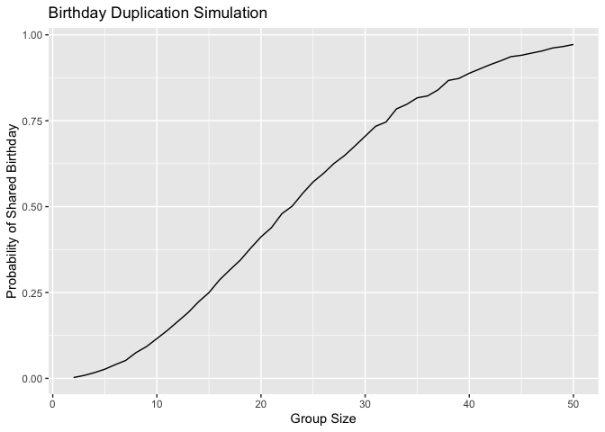

p8105_hw5_hy2958
================
2025-11-14

``` r
library(tidyverse)
```

    ## ── Attaching core tidyverse packages ──────────────────────── tidyverse 2.0.0 ──
    ## ✔ dplyr     1.1.4     ✔ readr     2.1.5
    ## ✔ forcats   1.0.0     ✔ stringr   1.5.1
    ## ✔ ggplot2   3.5.2     ✔ tibble    3.3.0
    ## ✔ lubridate 1.9.4     ✔ tidyr     1.3.1
    ## ✔ purrr     1.1.0     
    ## ── Conflicts ────────────────────────────────────────── tidyverse_conflicts() ──
    ## ✖ dplyr::filter() masks stats::filter()
    ## ✖ dplyr::lag()    masks stats::lag()
    ## ℹ Use the conflicted package (<http://conflicted.r-lib.org/>) to force all conflicts to become errors

``` r
set.seed(1)
```

``` r
#problem 1
has_duplicate_birthday <- function(n) {
  birthdays <- sample(1:365, size = n, replace = TRUE)
  any(duplicated(birthdays))
}

birthday_prob_loop <- function(n, n_sim = 10000) {
  result <- logical(n_sim)  ##create all 'false' list
  for (i in 1:n_sim) {
    result[i] <- has_duplicate_birthday(n)
  }
  mean(result)
}


birthday_df <- tibble(
  group_size = 2:50,
  prob_shared = map_dbl(2:50, birthday_prob_loop)
)

#plot
birthday_df %>%
  ggplot(aes(x = group_size, y = prob_shared)) +
  geom_line()+
  labs(
    title = "Birthday Duplication Simulation",
    x = "Group Size",
    y = "Probability of Shared Birthday"
  ) 
```

<!-- --> The
plot shows the estimated probability that at least two people in a group
share the same birthday changes with the group size.

When the group size is small, the probability is close to 0, as the
group size continues to increase, the probability grows quickly and
approaches 1.

``` r
#problem 2
simulate_one <- function(mu, n = 30, sigma = 5, alpha = 0.05) {
  x <- rnorm(n, mean = mu, sd = sigma)
  tibble(
    mu_hat = mean(x),
    p_value = t.test(x, mu = 0) |> broom::tidy() |> pull(p.value)
  )
}

simulate_many <- function(mu, nn=5000, n = 30, sigma = 5) {
  out <- vector("list", 5000) #create space
  for (i in 1:5000) {
    out[[i]] <- simulate_one(mu = mu, n = n, sigma = sigma)
  }
  bind_rows(out) |>
    mutate(mu_true = mu,
           reject = p_value < 0.05)
}
```
